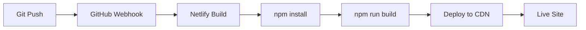

# Mobile App Review Insights Dashboard - Technical Documentation

## Table of Contents
1. [Project Overview](#project-overview)
2. [Business Requirements](#business-requirements)
3. [System Architecture](#system-architecture)
4. [Technology Stack](#technology-stack)
5. [UI/UX Design](#uiux-design)
6. [API Design & Integration](#api-design--integration)
7. [Nuxt-Specific Capabilities](#nuxt-specific-capabilities)
8. [Development Environment Setup](#development-environment-setup)
9. [Testing Strategy](#testing-strategy)
10. [DevOps & Deployment](#devops--deployment)
11. [Development Workflow](#development-workflow)
12. [Troubleshooting Guide](#troubleshooting-guide)

---

## Project Overview

### What It Does
A web application that analyzes mobile app reviews from both iOS App Store and Google Play Store, providing comprehensive analytics including sentiment analysis, rating distributions, and review insights.

### Key Features
- **Cross-Platform Analysis**: Fetches reviews from both iOS and Android platforms
- **Real-Time Data**: Gets the most recent 100 reviews per platform
- **Sentiment Analysis**: AI-powered sentiment classification (positive/neutral/negative)
- **Visual Analytics**: Rating distributions, sentiment summaries, platform comparisons
- **Performance Optimized**: In-memory caching, responsive design, efficient data processing

---

## Business Requirements

### Functional Requirements
1. **App Search & Discovery**
   - Users can search for any mobile app by name
   - System resolves app names to platform-specific app IDs
   - Handles apps available on one or both platforms

2. **Review Data Collection**
   - Fetch 100 most recent reviews from iOS App Store
   - Fetch 100 most recent reviews from Google Play Store
   - Normalize review data format across platforms

3. **Analytics & Insights**
   - Display app metadata (icon, name, developer, ratings)
   - Show rating distribution (1-5 stars)
   - Provide sentiment analysis breakdown
   - Present platform-specific statistics

4. **User Experience**
   - Fast loading times (<3 seconds)
   - Responsive design for all devices
   - Error handling with user-friendly messages
   - Intuitive navigation and search flow

### Non-Functional Requirements
- **Performance**: API responses cached for 5 minutes
- **Scalability**: Serverless architecture ready for auto-scaling
- **Reliability**: Graceful error handling, fallback mechanisms
- **Security**: Input validation, CORS protection
- **Maintainability**: TypeScript, modular architecture

---

## System Architecture

### High-Level Architecture
```
┌─────────────────┐    ┌──────────────────┐    ┌─────────────────────┐
│   Frontend      │    │   Nuxt Server    │    │  External APIs      │
│   (Vue/Nuxt)    │◄──►│   (Nitro)        │◄──►│  - App Store API    │
│                 │    │                  │    │  - Google Play API  │
└─────────────────┘    └──────────────────┘    └─────────────────────┘
        │                       │                        │
        │                       │                        │
        ▼                       ▼                        ▼
┌─────────────────┐    ┌──────────────────┐    ┌─────────────────────┐
│   Static Assets │    │   API Cache      │    │  Sentiment Engine   │
│   (Tailwind)    │    │   (In-Memory)    │    │  (NPM Package)      │
└─────────────────┘    └──────────────────┘    └─────────────────────┘
```

### Component Architecture
```
src/
├── pages/
│   ├── index.vue           # Landing page with search
│   └── dashboard.vue       # Analytics dashboard
├── server/api/
│   └── reviews.post.ts     # Main API endpoint
├── assets/
│   └── css/main.css        # Global styles
└── nuxt.config.ts          # Configuration
```

### Data Flow
1. **User Input**: Search for app name on landing page
2. **API Resolution**: Convert app name to platform-specific IDs
3. **Data Collection**: Fetch reviews from both platforms concurrently
4. **Data Processing**: Normalize, analyze sentiment, cache results
5. **UI Rendering**: Display analytics dashboard with insights
6. **Caching**: Store results for 5 minutes to improve performance

---

## Technology Stack

### Frontend Framework
- **Nuxt 3.13.0**: Full-stack Vue framework with SSR/SSG capabilities
- **Vue 3**: Composition API, reactive data binding
- **TypeScript**: Type safety and developer experience

### Styling & UI
- **Tailwind CSS**: Utility-first CSS framework
- **Responsive Design**: Mobile-first approach
- **Custom Components**: Reusable UI elements

### Backend & API
- **Nitro**: Nuxt's server engine for API routes
- **Node.js**: Server runtime environment
- **External APIs**:
  - `google-play-scraper`: Android app data and reviews
  - `app-store-scraper`: iOS app data and reviews
  - `sentiment`: Text sentiment analysis

### Development Tools
- **ESLint**: Code linting and formatting
- **Git**: Version control
- **npm**: Package management

### Deployment & DevOps
- **Netlify**: Static site hosting with serverless functions
- **GitHub**: Source code repository
- **Netlify CI/CD**: Automated build and deployment

---

## UI/UX Design

### Design Principles
- **Simplicity**: Clean, minimal interface focusing on data
- **Clarity**: Clear visual hierarchy and information architecture
- **Performance**: Fast loading, optimized for mobile
- **Accessibility**: Semantic HTML, proper contrast ratios

### Page Structure

#### Landing Page (`/`)
```
┌─────────────────────────────────────────┐
│        Mobile App Review Insights       │
│             Dashboard                   │
├─────────────────────────────────────────┤
│  [Search Box: "Enter app name..."]     │
│  [Get Insights Button]                 │
├─────────────────────────────────────────┤
│  📊 Rating Analytics                    │
│  ❤️ Sentiment Analysis                  │
│  📱 Cross-Platform                      │
└─────────────────────────────────────────┘
```

#### Dashboard Page (`/dashboard`)
```
┌─────────────────────────────────────────┐
│  ← Back    App Name Review Dashboard    │
├─────────────────────────────────────────┤
│  [App Icon] App Name                    │
│  by Developer                           │
│  ⭐⭐⭐⭐⭐ 4.5 iOS  ⭐⭐⭐⭐⭐ 4.3 Android│
├─────────────────────────────────────────┤
│  📄 100   ⭐ 4.4   💚 65%   📱 50/50   │
│  Recent   Avg      Positive  iOS/And    │
├─────────────────────────────────────────┤
│  Rating Distribution    Sentiment       │
│  5⭐ ████████████       Positive 65%    │
│  4⭐ ████████           Neutral  20%    │
│  3⭐ ████               Negative 15%    │
├─────────────────────────────────────────┤
│  All Reviews - Most Recent (100)       │
│  ┌─────────────────────────────────────┐│
│  │ ⭐⭐⭐⭐⭐ 5/5    Sep 20, 2025  iOS  ││
│  │ Great App!                          ││
│  │ Love this app, works perfectly...   ││
│  └─────────────────────────────────────┘│
│  [Scrollable list of reviews...]       │
└─────────────────────────────────────────┘
```

### Color Scheme
- **Primary**: Blue (#3B82F6) for actions and highlights
- **Success**: Green (#10B981) for positive sentiment
- **Warning**: Yellow (#F59E0B) for neutral sentiment
- **Danger**: Red (#EF4444) for negative sentiment
- **Neutral**: Gray scale for text and backgrounds

---

## API Design & Integration

### Main API Endpoint

#### `POST /api/reviews`
**Purpose**: Fetch and analyze app reviews from both platforms

**Request Body**:
```json
{
  "appName": "Instagram"
}
```

**Response Format**:
```json
{
  "success": true,
  "appInfo": {
    "searchTerm": "Instagram",
    "foundApps": {
      "ios": {
        "id": "389801252",
        "name": "Instagram",
        "rating": 4.5,
        "ratingCount": 2500000,
        "icon": "https://...",
        "developer": "Instagram, Inc.",
        "price": "Free"
      },
      "android": {
        "id": "com.instagram.android",
        "name": "Instagram",
        "rating": 4.3,
        "ratingCount": 5000000,
        "icon": "https://...",
        "developer": "Instagram",
        "price": "Free"
      }
    }
  },
  "reviews": [
    {
      "rating": 5,
      "date": "2025-09-20T15:18:13.256Z",
      "title": "Great app!",
      "content": "Love this app, works perfectly...",
      "sentiment": "positive",
      "source": "ios"
    }
  ],
  "totalReviews": 100,
  "summary": {
    "ios": 50,
    "android": 50,
    "sentimentDistribution": {
      "positive": 65,
      "neutral": 20,
      "negative": 15
    },
    "ratingDistribution": {
      "5": 45,
      "4": 25,
      "3": 15,
      "2": 10,
      "1": 5
    }
  }
}
```

### External API Integration

#### App Store Scraper
```javascript
import store from 'app-store-scraper'

// Search for apps
const searchResults = await store.search({
  term: appName,
  num: 5,
  country: 'us'
})

// Get app details
const appDetails = await store.app({
  id: appId,
  country: 'us'
})

// Fetch reviews
const reviews = await store.reviews({
  id: appId,
  sort: store.sort.RECENT,
  page: 1,
  country: 'us'
})
```

#### Google Play Scraper
```javascript
import gplay from 'google-play-scraper'

// Search for apps
const searchResults = await gplay.search({
  term: appName,
  num: 5,
  country: 'us'
})

// Get app details
const appDetails = await gplay.app({
  appId: appId,
  country: 'us'
})

// Fetch reviews
const reviews = await gplay.reviews({
  appId: appId,
  sort: gplay.sort.NEWEST,
  num: 50,
  country: 'us',
  lang: 'en'
})
```

### Caching Strategy
```javascript
// Simple in-memory cache with TTL
const cache = new Map()
const CACHE_TTL = 5 * 60 * 1000 // 5 minutes

function getCachedData(key) {
  const cached = cache.get(key)
  if (cached && Date.now() - cached.timestamp < CACHE_TTL) {
    return cached.data
  }
  return null
}

function setCachedData(key, data) {
  cache.set(key, {
    data,
    timestamp: Date.now()
  })
}
```

---

## Nuxt-Specific Capabilities

### Beyond Basic Vue Framework

#### 1. **Server-Side Rendering (SSR)**
- **Benefit**: Improved SEO and initial page load performance
- **Implementation**: Automatic SSR for all pages
- **Configuration**: `ssr: true` in nuxt.config.ts

#### 2. **File-Based Routing**
- **Benefit**: Automatic route generation from file structure
- **Structure**:
  ```
  pages/
  ├── index.vue      → /
  └── dashboard.vue  → /dashboard
  ```

#### 3. **Auto-Import System**
- **Benefit**: No need to manually import Vue composables
- **Usage**: `ref()`, `computed()`, `useRoute()` available globally

#### 4. **Built-in API Routes**
- **Benefit**: Full-stack development in single framework
- **Structure**:
  ```
  server/api/
  └── reviews.post.ts → POST /api/reviews
  ```

#### 5. **Nitro Server Engine**
- **Benefit**: Optimized server with edge-side rendering
- **Features**: Automatic API optimization, serverless deployment ready

#### 6. **Module Ecosystem**
- **@nuxtjs/tailwindcss**: Automatic Tailwind integration
- **Auto-configuration**: Zero-config setup for most features

#### 7. **Development Experience**
- **Hot Module Replacement**: Instant updates during development
- **TypeScript Support**: Built-in TypeScript integration
- **DevTools**: Browser extension for debugging

#### 8. **Build Optimizations**
- **Code Splitting**: Automatic route-based splitting
- **Tree Shaking**: Remove unused code
- **Asset Optimization**: Image and CSS optimization

---

## Development Environment Setup

### Prerequisites
```bash
# Required software
- Node.js 18+ 
- npm 8+
- Git 2.30+
```

### Initial Setup
```bash
# 1. Clone repository
git clone https://github.com/sherryshenelia/nuxt-mobile-app-review-insights.git
cd nuxt-mobile-app-review-insights

# 2. Install dependencies
npm install

# 3. Set up environment variables
cp .env.example .env
# Edit .env with your configuration (if needed)

# 4. Start development server
npm run dev

# 5. Open browser
open http://localhost:3000
```

### Project Structure
```
nuxt-mobile-app-review-insights/
├── .nuxt/                 # Auto-generated Nuxt files
├── .output/               # Build output
├── assets/                # Uncompiled assets
├── node_modules/          # Dependencies
├── pages/                 # Vue pages (auto-routed)
│   ├── index.vue         # Landing page
│   └── dashboard.vue     # Dashboard page
├── server/               # Server-side code
│   └── api/              # API endpoints
│       └── reviews.post.ts
├── .env.example          # Environment variables template
├── .gitignore           # Git ignore rules
├── .nuxtignore          # Nuxt ignore rules
├── app.vue              # Root Vue component
├── netlify.toml         # Netlify configuration
├── nuxt.config.ts       # Nuxt configuration
├── package.json         # Project dependencies
├── README.md            # Project documentation
└── tailwind.config.js   # Tailwind configuration
```

### Available Scripts
```bash
# Development
npm run dev          # Start dev server
npm run build        # Build for production
npm run preview      # Preview production build
npm run generate     # Generate static site

# Code Quality
npm run lint         # Run ESLint
npm run type-check   # TypeScript type checking
```

### Environment Configuration
```bash
# .env (optional - no external APIs require keys)
NODE_ENV=development
NUXT_PUBLIC_API_BASE=/api
```

---

## Testing Strategy

### Manual Testing Checklist

#### Functional Testing
- [ ] **Landing Page**
  - [ ] Page loads without errors
  - [ ] Search input accepts text
  - [ ] Search button is enabled when text is entered
  - [ ] Error messages display for invalid apps
  - [ ] Loading state shows during API calls

- [ ] **Dashboard Page**
  - [ ] App info card displays correctly
  - [ ] Both iOS and Android ratings show (when available)
  - [ ] Summary statistics are accurate
  - [ ] Rating distribution chart renders
  - [ ] Sentiment analysis percentages are correct
  - [ ] All reviews display with proper formatting
  - [ ] Dates show as "Sep 20, 2025" format (not "No date")
  - [ ] Reviews are scrollable
  - [ ] Back button returns to landing page

#### API Testing
```bash
# Test API endpoint directly
curl -X POST http://localhost:3000/api/reviews \
  -H "Content-Type: application/json" \
  -d '{"appName":"Instagram"}'

# Expected response should include:
# - success: true
# - appInfo with iOS/Android details
# - reviews array with date fields
# - summary statistics
```

#### Cross-Platform Testing
- [ ] **iOS Apps**: Instagram, WhatsApp, TikTok
- [ ] **Android Apps**: Same apps should work
- [ ] **Mixed Availability**: Apps on one platform only
- [ ] **Invalid Apps**: Non-existent app names

#### Performance Testing
- [ ] **Initial Load**: < 3 seconds
- [ ] **API Response**: < 10 seconds for new apps
- [ ] **Cached Response**: < 1 second for cached apps
- [ ] **Mobile Performance**: Smooth scrolling on mobile

#### Error Handling Testing
- [ ] **Network Errors**: Disconnect internet during API call
- [ ] **Invalid Input**: Empty search, special characters
- [ ] **API Failures**: Mock API errors
- [ ] **No Results**: Search for non-existent apps

### Automated Testing (Future Implementation)
```javascript
// Example test structure (not implemented)
describe('Reviews API', () => {
  test('should return reviews for valid app', async () => {
    const response = await fetch('/api/reviews', {
      method: 'POST',
      body: JSON.stringify({ appName: 'Instagram' })
    })
    const data = await response.json()
    expect(data.success).toBe(true)
    expect(data.reviews.length).toBeGreaterThan(0)
  })
})
```

---

## DevOps & Deployment

### Hosting Platform: Netlify

#### Why Netlify?
- **Serverless Functions**: Perfect for Nuxt API routes
- **Automatic Deployments**: Git-based CI/CD
- **Global CDN**: Fast content delivery
- **Free Tier**: Sufficient for development and testing

#### Deployment Configuration

**netlify.toml**:
```toml
[build]
  command = "npm run build"
  publish = "dist"
  environment = { NODE_VERSION = "20", NODE_ENV = "production" }

# SPA routing support
[[redirects]]
  from = "/*"
  to = "/index.html"
  status = 200

# Security headers
[[headers]]
  for = "/*"
  [headers.values]
    X-Frame-Options = "DENY"
    X-XSS-Protection = "1; mode=block"
    X-Content-Type-Options = "nosniff"
```

**nuxt.config.ts** (Netlify-specific):
```typescript
export default defineNuxtConfig({
  nitro: {
    preset: 'netlify'  // Optimize for Netlify deployment
  }
})
```

### CI/CD Pipeline

#### GitHub Integration
1. **Source Control**: All code in GitHub repository
2. **Automatic Builds**: Netlify builds on every push to main
3. **Preview Deployments**: Branch deployments for testing
4. **Build Logs**: Detailed build process visibility

#### Deployment Process


#### Build Commands
```bash
# Netlify runs these automatically
npm install           # Install dependencies
npm run build        # Build for production
# Deploys dist/ folder to CDN
```

### Environment Management

#### Development
- **Local**: `npm run dev` on http://localhost:3000
- **Hot Reload**: Instant updates during development
- **API**: Server-side functions run locally

#### Production
- **URL**: https://imaginative-meerkat-f44fa3.netlify.app
- **CDN**: Global content delivery
- **Serverless**: API routes as Netlify Functions

### Monitoring & Maintenance

#### Performance Monitoring
- **Netlify Analytics**: Built-in traffic and performance metrics
- **Core Web Vitals**: Lighthouse scores in Netlify
- **Error Tracking**: Console errors and build failures

#### Maintenance Tasks
- **Dependency Updates**: Monthly npm audit and updates
- **Security Patches**: Automated security updates
- **Performance Optimization**: Regular Lighthouse audits

---

## Development Workflow

### Git Workflow
```bash
# Feature development
git checkout -b feature/new-feature
git add .
git commit -m "Add new feature with clear description"
git push origin feature/new-feature

# Create pull request (optional for solo development)
# Merge to main triggers deployment
git checkout main
git merge feature/new-feature
git push origin main  # Triggers Netlify deployment
```

### Commit Message Convention
```
feat: add sentiment analysis to reviews
fix: resolve date formatting issue  
docs: update API documentation
style: improve mobile responsive design
perf: implement API response caching
refactor: reorganize component structure
test: add API endpoint tests
```

### Development Process

#### 1. **Planning Phase**
- Define requirements and user stories
- Create wireframes and component structure
- Plan API endpoints and data flow

#### 2. **Implementation Phase**
- Set up project structure and dependencies
- Implement core functionality (API, UI components)
- Add styling and responsive design
- Implement error handling and validation

#### 3. **Testing Phase**
- Manual testing of all user flows
- API testing with various inputs
- Cross-browser and device testing
- Performance optimization

#### 4. **Deployment Phase**
- Configure build settings
- Set up CI/CD pipeline
- Deploy to staging environment
- Production deployment and monitoring

#### 5. **Maintenance Phase**
- Monitor performance and errors
- Collect user feedback
- Plan and implement improvements
- Regular security and dependency updates

### Code Organization Principles

#### Component Structure
```vue
<template>
  <!-- Clean, semantic HTML -->
</template>

<script setup>
// Composition API with TypeScript
// Reactive data and computed properties
// Event handlers and lifecycle hooks
</script>

<style scoped>
/* Component-specific styles (rare with Tailwind) */
</style>
```

#### API Structure
```typescript
// Clear function separation
async function findAppIds(appName: string): Promise<AppSearchResult>
async function fetchIOSReviews(appId: string): Promise<ReviewData[]>
async function fetchAndroidReviews(appId: string): Promise<ReviewData[]>

// Main handler with error handling
export default defineEventHandler(async (event) => {
  // Input validation
  // Business logic
  // Error handling
  // Response formatting
})
```

### Debugging Workflow

#### Common Issues & Solutions

1. **"No Date" in Reviews**
   ```bash
   # Check API response format
   curl -X POST localhost:3000/api/reviews -d '{"appName":"test"}'
   # Verify date field mapping in API
   ```

2. **Page Not Found (404)**
   ```bash
   # Check Nuxt page detection
   # Ensure pages/ directory structure
   # Verify app.vue has <NuxtPage />
   ```

3. **API Not Responding**
   ```bash
   # Check server process
   ps aux | grep nuxt
   # Restart development server
   npm run dev
   ```

4. **Build Failures**
   ```bash
   # Check build logs
   npm run build
   # Verify all dependencies installed
   npm install
   ```

---

## Troubleshooting Guide

### Common Development Issues

#### 1. Server Won't Start
**Symptoms**: `npm run dev` fails or hangs
**Solutions**:
```bash
# Kill existing processes
pkill -f "nuxt dev"
# Clear cache
rm -rf .nuxt node_modules/.cache
# Reinstall dependencies
npm install
# Start fresh
npm run dev
```

#### 2. API Returns Empty Data
**Symptoms**: Reviews array is empty or missing
**Debugging**:
```bash
# Test external APIs directly
node -e "
const gplay = require('google-play-scraper');
gplay.search({term: 'Instagram', num: 1})
  .then(console.log)
  .catch(console.error);
"
```

#### 3. Date Formatting Issues
**Symptoms**: "No date" or "Invalid Date" in reviews
**Check**:
- API response includes date field
- Date format is parseable by JavaScript Date()
- formatDate function handles edge cases

#### 4. Netlify Deployment Fails
**Common Causes**:
- Wrong publish directory in netlify.toml
- Missing environment variables
- Build command errors
- Node.js version mismatch

**Solutions**:
```bash
# Test build locally
npm run build
# Check build output directory
ls -la dist/
# Verify netlify.toml configuration
```

### Performance Issues

#### 1. Slow API Responses
**Solutions**:
- Check cache implementation
- Reduce review limit if needed
- Monitor external API rate limits

#### 2. Large Bundle Size
**Solutions**:
```bash
# Analyze bundle
npm run build --analyze
# Remove unused dependencies
npm uninstall [unused-package]
```

### Production Issues

#### 1. 404 Errors on Refresh
**Cause**: SPA routing not configured
**Solution**: Ensure netlify.toml has redirect rules

#### 2. API Functions Not Working
**Cause**: Serverless function deployment issues
**Solution**: Check Netlify function logs

---

## Next Steps & Improvements

### Short-term Enhancements
- [ ] Add loading skeletons for better UX
- [ ] Implement review filtering (by rating, sentiment)
- [ ] Add more detailed app information
- [ ] Improve error messaging

### Medium-term Features
- [ ] User authentication and saved searches
- [ ] Historical data tracking
- [ ] Email alerts for app rating changes
- [ ] Competitor comparison features

### Long-term Vision
- [ ] Machine learning for trend prediction
- [ ] API for third-party integrations
- [ ] White-label solution for businesses
- [ ] Mobile app companion

---

## Conclusion

This documentation provides a comprehensive guide for understanding, developing, and maintaining the Mobile App Review Insights Dashboard. The project demonstrates modern full-stack development practices using Nuxt 3, with a focus on performance, user experience, and maintainable code architecture.

For questions or contributions, please refer to the GitHub repository or contact the development team.
